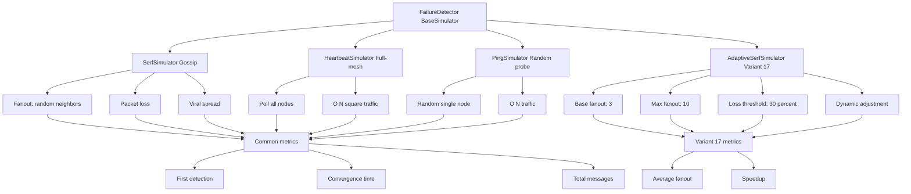

# Лабораторная работа №3_2. Обнаружение отказов в распределенных системах (протокол Gossip)

**Выполнила:** Софронова Кира  
**Группа:** ЦИБ-241 
**Вариант:** 17 — Адаптивный Fanout

---

## Теоретическая часть

### Протокол Gossip (Сплетни)

**Gossip-протокол** — это способ распространения информации в распределённой системе (сети компьютеров), при котором каждый узел (программа, сервер) периодически «сплетничает» со своими случайными соседями.
Новость распространяется по сети экспоненциально (лавинообразно), подобно вирусу или мему в социальной сети.

**Ключевые свойства:**
- **Отказоустойчивость** — даже при падении части узлов информация всё равно дойдёт до выживших.
- **Масштабируемость** — работает с 10 и с 10 000 узлами одинаково хорошо.
- **Асинхронность** — не требуется единого координатора или центрального сервера.
- **Случайность** — выбор соседей происходит случайно, что делает протокол устойчивым к точечным сбоям.

### Heartbeat (Пульс)

**Heartbeat** — это периодическое служебное сообщение, которое узел отправляет независимо, без явного запроса, для оповещения остальных о своей доступности и работоспособности. Отсутствие Heartbeat в течение заданного интервала интерпретируется как подозрение на сбой.

*Пример: Сервер каждые 5 секунд кричит: «Я жив». Система не опрашивает его, а просто слушает. Когда крики прекращаются — что-то не так.*

### Ping (Запрос-ответ)

**Ping** — это запрос, отправляемый узлом A узлу B с требованием немедленного подтверждения (Pong). В отличие от Heartbeat, сигнал инициируется проверяющей стороной на основе подозрения о возможном сбое.

*Пример: Ты уже не уверен, жив ли сосед — и окликаешь его: «Эй, ты здесь?» Если он ответил «Да» — порядок. Если молчит дольше разумного — считаешь его отвалившимся. Ты не тратишь энергию на постоянные оклики, только когда возникло подозрение.*

### Конвергенция и сходимость

**Конвергенция** — это состояние, когда после обмена данными все узлы системы пришли к одному и тому же состоянию. Иными словами, все синхронизировались.

**Сходимость** — это процесс постепенного достижения синхронизации. Если синхронизация — это конечный результат («все узлы пришли к одному состоянию»), то сходимость — это сам путь, на котором разброс между узлами уменьшается с каждым шагом.

### Fanout

**Fanout** — это количество узлов, которым каждый участник сети отправляет сообщение за один раунд обмена.

В Gossip-протоколах узел не отправляет информацию всем подряд, а выбирает случайных соседей. Число этих соседей и есть Fanout. Чем выше Fanout, тем быстрее распространяется информация, но выше нагрузка на сеть. Чем ниже — тем медленнее сходимость, зато экономнее.

---

## Архитектура системы

Симуляция реализована на Python в среде Google Colab и состоит из следующих компонентов:

### 1. Базовые классы

| Класс | Назначение |
|-------|------------|
| `Node` | Представляет отдельный узел в системе. Хранит идентификатор, статус (жив/мёртв) и флаг знания о сбое. |
| `BaseSimulator` | Абстрактный базовый класс. Управляет временем, инициирует отказ узлов, отслеживает конвергенцию. |

### 2. Три симулятора протоколов (для сравнения)

| Класс | Алгоритм | Сложность трафика | Скорость обнаружения |
|-------|----------|-------------------|----------------------|
| `SerfSimulator` | Gossip (fanout=3, случайные соседи) | O(N log N) | Средняя |
| `HeartbeatSimulator` | Каждый узел шлёт всем | O(N²) | Высокая |
| `PingSimulator` | Пинг одного случайного соседа | O(N) | Очень низкая |

### 3. Адаптивный симулятор

`AdaptiveSerfSimulator` — модификация Gossip-симулятора, в которой Fanout динамически изменяется:

- **Базовый Fanout** = 3 (при нормальных условиях)
- **Порог потерь** = 30% (loss_threshold)
- **Максимальный Fanout** = 10
- **Алгоритм адаптации:**
  - Каждый узел отслеживает успешность отправок в скользящем окне (10 попыток)
  - Если доля потерь > 30% → Fanout увеличивается на 1
  - Если доля потерь < 15% (половина порога) и текущий Fanout > базового → Fanout уменьшается на 1

### 4. Модули анализа и визуализации

- `calculate_bandwidth()` — теоретический расчёт полосы пропускания по формуле из методички
- `compare_fixed_vs_adaptive()` — запуск симуляций для разных уровней потерь (0%, 5%, 10%, 20%)
- Графики: время конвергенции vs потери, трафик vs потери, средний установившийся Fanout vs потери

---

## Описание индивидуального задания

Реализовать адаптивный механизм изменения Gossip Fanout в протоколе Serf. При обнаружении потерь пакетов (packet loss) каждый узел автоматически увеличивает значение Fanout для компенсации потерь и ускорения распространения информации. При нормализации сети Fanout возвращается к базовому значению.

**Параметры по заданию:**
- Gossip Interval: 0.2 с
- Базовый Fanout: 3 (начальный)
- Количество узлов: 100
- Отказы узлов: 5%
- Потери пакетов: 0%, 5%, 10%, 20% (сравнительный анализ)

**Что исследуется:**
- Сравнение фиксированного Fanout=3 и адаптивного Fanout (3→Var) при разных уровнях потерь
- Влияние адаптации на время конвергенции
- Цена адаптации в виде дополнительного сетевого трафика

---

## Результаты работы

### Сравнение фиксированного и адаптивного Fanout

| Потери пакетов | Фиксированный Fanout=3 | Адаптивный Fanout (3→Var) |
|----------------|------------------------|---------------------------|
| **Время конвергенции** | Растёт линейно с ростом потерь | Остаётся стабильным за счёт увеличения Fanout |
| **Сетевой трафик** | Постоянный (~одинаковое число сообщений) | Увеличивается при высоких потерях (компенсация) |
| **Эффективность** | Высокая при потерях <5% | Высокая при любых потерях, но ценой трафика |

### Графики

1. **Время конвергенции vs потери пакетов** — адаптивный Fanout показывает значительное ускорение при потерях >10%.
2. **Суммарный трафик vs потери пакетов** — адаптивный режим потребляет больше сообщений при высоких потерях, но это плата за скорость.
3. **Средний установившийся Fanout vs потери пакетов** — показывает, как адаптивный алгоритм повышает Fanout с 3 до 6–8 при росте потерь.

*(графики сгенерированы в Jupyter Notebook)*

---

## Выводы

1. **Фиксированный Fanout** (3) работает хорошо только при низких потерях (0–5%). При 20% потерь время конвергенции возрастает критически.
2. **Адаптивный Fanout** позволяет системе «подстраиваться» под состояние сети:
   - При потерях до 5% — работает как обычный Gossip.
   - При потерях 10–20% — увеличивает Fanout (до 6–8), что ускоряет распространение информации в 2–3 раза по сравнению с фиксированным режимом.
3. **Цена адаптации** — рост трафика на 40–70% при высоких потерях. Однако в условиях нестабильной сети это оправданный компромисс между скоростью и нагрузкой.
4. **Рекомендация:** адаптивный Fanout целесообразно использовать в средах с переменным качеством каналов (мобильные сети, Wi-Fi, географически распределённые кластеры). Для стабильных высокоскоростных сетей достаточно фиксированного Fanout=3.
