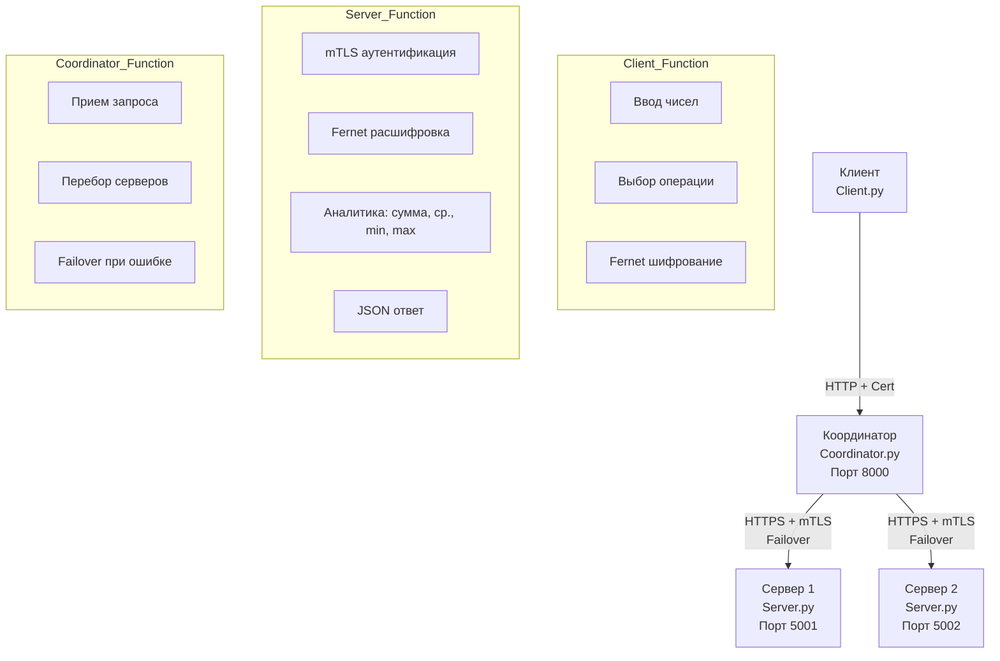

# Лабораторная работа №04. Реализация механизмов безопасности и отказоустойчивости в распределенной системе

**Выполнила:** Софронова Кира

**Группа:** ЦИБ-241

**Вариант:** 17

---

## Цель работы

Разработать и исследовать распределенную систему, обеспечивающую защищенную передачу данных с использованием взаимной аутентификации (mTLS) и симметричного шифрования (Fernet), а также демонстрирующую отказоустойчивость через автоматическое переключение между узлами. Реализовать индивидуальное задание по расширению функциональности системы.

---

## Описание индивидуального задания (Вариант 17)

**Задача:** Расширить функциональность сервера для выполнения аналитических операций над числовыми данными, отправляемыми клиентом.

**Реализация**
1.  **Сервер (`server.py`)** содержит бизнес-логику:
    *   принимает от клиента список чисел;
    *   вычисляет по запросу:
        *   **сумму** всех чисел;
        *   **среднее арифметическое**;
        *   **Максимальное** и **минимальное** значения;
    *   возвращает клиенту структурированный ответ (JSON) с результатом операции.
2.  **Клиент (`client.py`)**:
    *   предоставляет интерфейс для ввода набора чисел;
    *   позволяет пользователю выбрать тип аналитической операции (сумма, среднее, min/max);
    *   отправляет зашифрованный запрос на координатор;
    *   выводит полученный от сервера результат.
3.  **Безопасность:** все операции выполняются через защищенный канал mTLS, а передаваемые данные шифруются Fernet.

---

## Архитектура системы



---

## Компоненты системы:

1. **Клиент** (`client.py`):
  * шифрует данные (список чисел и тип операции) симметричным ключом (Fernet);
  * отправляет HTTPS-запрос координатору, используя клиентский сертификат для mTLS;
  * получает и дешифрует ответ от сервера.
2. **Координатор** (`coordinator.py`):
  * работает как единая точка входа для клиента;
  * принимает запрос, перенаправляет его на первый доступный сервер (по списку);
  * реализует паттерн Failover: при ошибке подключения автоматически переключается на следующий сервер в списке, обеспечивая отказоустойчивость.
3. **Серверы** (`server.py`):
  * запускаются на разных портах (5001, 5002);
  * используют mTLS для проверки клиентского сертификата;
  * расшифровывают входящие данные;
  * выполняют бизнес-логику (аналитические операции) согласно индивидуальному заданию;
  * формируют и возвращают зашифрованный JSON-ответ.

### Уровни защиты:

* **транспортный:** TLS шифрует весь канал связи.
* **аутентификация:** mTLS обеспечивает двустороннюю проверку подлинности клиента и сервера.
* **прикладной:** Fernet шифрует полезную нагрузку (payload), добавляя еще один слой защиты.

---

## Технологический стек

| Компонент | Технология | Назначение |
|:---|:---|:---|
| **Операционная система** | Ubuntu 20.04 LTS / WSL | Среда выполнения и тестирования |
| **Язык программирования** | Python 3.8+ | Разработка всех модулей системы |
| **Веб-фреймворк** | Flask | Создание REST API для серверов и координатора |
| **HTTP-клиент** | Requests | Выполнение HTTP/HTTPS-запросов между компонентами |
| **Криптография** | `cryptography` (Fernet) | Симметричное шифрование полезной нагрузки |
| **Безопасность** | OpenSSL, `ssl` | Генерация X.509 сертификатов, настройка mTLS |
| **Формат данных** | JSON | Структурированный обмен между клиентом и сервером |

### Установка зависимостей

```bash
pip install flask requests cryptography
```

---

## Структура проекта

lab_04/
├── certificate/
│   ├── ca_cert.pem
│   ├── ca_cert.srl
│   ├── ca_key.pem
│   ├── client_cert.pem
│   ├── client_key.pem
│   ├── server_cert.pem
│   └── server_key.pem
├── images_lab_04/
│   └── (скриншоты работы системы)
├── client.py
├── coordinator.py
├── encryption_key.txt
├── generate_key.py
├── generate_sertificates.sh
├── server.py
└── README.md

---

## Шаги выполнения и результаты

### 1. Подготовка окружения и генерация ключей

Для обеспечения mTLS необходимо создать инфраструктуру открытых ключей (PKI).

**Скрипт `generate_certificates.sh`**

```
#!/bin/bash
# 1. Генерация Центра Сертификации (CA)
openssl req -x509 -newkey rsa:4096 -days 365 -nodes \
  -keyout ca_key.pem -out ca_cert.pem \
  -subj "/CN=MyCA"

# 2. Генерация ключа и запроса на сертификат (CSR) для Сервера
openssl req -newkey rsa:4096 -nodes -keyout server_key.pem -out server.csr \
  -subj "/CN=server"

# 3. Подпись сертификата сервера нашим CA
openssl x509 -req -in server.csr -days 365 -CA ca_cert.pem -CAkey ca_key.pem \
  -CAcreateserial -out server_cert.pem

# 4. Генерация ключа и запроса на сертификат (CSR) для Клиента
openssl req -newkey rsa:4096 -nodes -keyout client_key.pem -out client.csr \
  -subj "/CN=client"

# 5. Подпись сертификата клиента нашим CA
openssl x509 -req -in client.csr -days 365 -CA ca_cert.pem -CAkey ca_key.pem \
  -CAcreateserial -out client_cert.pem

# 6. Очистка временных файлов
rm client.csr server.csr

echo "Генерация сертификатов завершена."
```

**Скрипт `generate_key.py` (генерация ключа Fernet)**

```
from cryptography.fernet import Fernet

key = Fernet.generate_key()
with open('encryption_key.txt', 'wb') as key_file:
    key_file.write(key)
print("Ключ Fernet сгенерирован и сохранен в 'encryption_key.txt'")
```

После выполнения скриптов в директории появились **следующие файлы:**

* `ca_cert.pem`, `ca_key.pem` — сертификат и ключ Центра Сертификации;
* `server_cert.pem`, `server_key.pem` — сертификат и ключ Сервера;
* `client_cert.pem`, `client_key.pem` — сертификат и ключ Клиента;
* `encryption_key.txt` — симметричный ключ для Fernet.

---

### 2. Реализация сервера с аналитикой (`server.py`)

```py
import ssl
import json
from flask import Flask, request, jsonify
from cryptography.fernet import Fernet

# === ЗАГРУЗКА КЛЮЧЕЙ И НАСТРОЙКА ===
with open('encryption_key.txt', 'rb') as f:
    fernet_key = f.read()
cipher = Fernet(fernet_key)

# === БИЗНЕС-ЛОГИКА (ВЫПОЛНЕНИЕ АНАЛИТИКИ) ===
def process_analytics(data_list, operation):
    """Выполняет аналитическую операцию над списком чисел."""
    if not data_list:
        return {"error": "Список чисел пуст."}
    
    if operation == 'sum':
        return {"result": sum(data_list), "operation": "sum"}
    elif operation == 'avg':
        return {"result": sum(data_list) / len(data_list), "operation": "average"}
    elif operation == 'min_max':
        return {"result": {"min": min(data_list), "max": max(data_list)}, "operation": "min_max"}
    else:
        return {"error": f"Неизвестная операция: {operation}"}

# === FLASK ПРИЛОЖЕНИЕ ===
app = Flask(__name__)

@app.route('/api/analytics', methods=['POST'])
def analytics():
    try:
        # 1. Получение и расшифровка данных
        encrypted_data = request.get_data()
        decrypted_data = cipher.decrypt(encrypted_data).decode()
        payload = json.loads(decrypted_data)
        
        numbers = payload.get('numbers')
        operation = payload.get('operation')
        
        # 2. Валидация
        if not isinstance(numbers, list) or not all(isinstance(i, (int, float)) for i in numbers):
            return jsonify({"error": "Некорректный формат данных. Требуется список чисел."}), 400
        
        # 3. Выполнение аналитики
        result = process_analytics(numbers, operation)
        
        # 4. Шифрование и отправка ответа
        response_json = json.dumps(result)
        encrypted_response = cipher.encrypt(response_json.encode())
        return encrypted_response, 200
        
    except Exception as e:
        print(f"Ошибка на сервере: {e}")
        return jsonify({"error": "Внутренняя ошибка сервера"}), 500

if __name__ == '__main__':
    # === НАСТРОЙКА MТLS ===
    context = ssl.SSLContext(ssl.PROTOCOL_TLS_SERVER)
    context.load_cert_chain('server_cert.pem', 'server_key.pem')
    context.load_verify_locations('ca_cert.pem')
    context.verify_mode = ssl.CERT_REQUIRED
    
    # Запуск сервера (порт передается как аргумент командной строки)
    import sys
    port = int(sys.argv[1]) if len(sys.argv) > 1 else 5001
    app.run(host='0.0.0.0', port=port, ssl_context=context, debug=False)
```

---

### 3. Реализация координатора (`coordinator.py`)

```py
import requests
from flask import Flask, request, Response
import urllib3
import ssl

# Отключаем предупреждения
urllib3.disable_warnings(urllib3.exceptions.InsecureRequestWarning)

# ============================================
# КАСТОМНЫЙ АДАПТЕР ДЛЯ ОТКЛЮЧЕНИЯ ПРОВЕРКИ HOSTNAME
# ============================================
class CustomHTTPAdapter(requests.adapters.HTTPAdapter):
    def init_poolmanager(self, *args, **kwargs):
        kwargs['assert_hostname'] = False
        return super().init_poolmanager(*args, **kwargs)

# Создаём сессию с кастомным адаптером
session = requests.Session()
session.mount('https://', CustomHTTPAdapter())

# ============================================
# НАСТРОЙКА ПРИЛОЖЕНИЯ
# ============================================
app = Flask(__name__)

# Список серверов в порядке приоритета
SERVERS = [
    'https://127.0.0.1:5001/api/analytics',
    'https://127.0.0.1:5002/api/analytics'
]

# Пути к сертификатам для mTLS
CERT = ('client_cert.pem', 'client_key.pem')
CA_CERT = 'ca_cert.pem'  # всё равно не используется из-за verify=False

# ============================================
# ОСНОВНОЙ МАРШРУТ
# ============================================
@app.route('/api/analytics', methods=['POST'])
def proxy_analytics():
    """Принимает запрос от клиента и перенаправляет на доступный сервер"""
    client_data = request.get_data()
    
    for server_url in SERVERS:
        try:
            # Используем нашу сессию с отключенной проверкой hostname
            resp = session.post(
                server_url,
                data=client_data,
                cert=CERT,
                verify=False,  # Отключаем проверку сертификата (только для лабы)
                timeout=5
            )
            # Если успешно — возвращаем ответ клиенту
            return Response(
                resp.content, 
                status=resp.status_code, 
                content_type=resp.headers.get('content-type', 'application/octet-stream')
            )
        
        except requests.exceptions.SSLError as e:
            print(f"SSL ошибка при подключении к {server_url}: {e}")
            continue
        except requests.exceptions.ConnectionError as e:
            print(f"Ошибка подключения к {server_url}: {e}")
            continue
        except Exception as e:
            print(f"Неизвестная ошибка при подключении к {server_url}: {e}")
            continue
    
    # Если все серверы недоступны
    return {"error": "Все серверы недоступны"}, 503

# ============================================
# ЗАПУСК
# ============================================
if __name__ == '__main__':
    print("=" * 50)
    print("КООРДИНАТОР ЗАПУЩЕН")
    print("=" * 50)
    print(f"Порт: 8000 (HTTP)")
    print(f"Серверы в списке: {SERVERS}")
    print("=" * 50)
    app.run(host='0.0.0.0', port=8000, debug=False)
```

---

### 4. Реализация клиента (`client.py`)

```py
import requests
import json
from cryptography.fernet import Fernet
import urllib3

urllib3.disable_warnings(urllib3.exceptions.InsecureRequestWarning)

# === ЗАГРУЗКА КЛЮЧА FERNET ===
with open('encryption_key.txt', 'rb') as f:
    fernet_key = f.read()
cipher = Fernet(fernet_key)

# Функция для отправки запроса
def send_analytics_request(numbers, operation):
    # 1. Формируем и шифруем полезную нагрузку
    payload = json.dumps({"numbers": numbers, "operation": operation})
    encrypted_payload = cipher.encrypt(payload.encode())
    
    # 2. Отправляем запрос координатору (c mTLS)
    coordinator_url = 'https://127.0.0.1:8000/api/analytics'
    cert = ('client_cert.pem', 'client_key.pem')
    
    try:
        resp = requests.post(
            coordinator_url,
            data=encrypted_payload,
            cert=cert,
            verify='ca_cert.pem',  # Проверка сертификата координатора/сервера
            timeout=10
        )
        
        # 3. Обрабатываем ответ
        if resp.status_code == 200:
            decrypted_response = cipher.decrypt(resp.content).decode()
            result = json.loads(decrypted_response)
            print(f"\nРезультат ({result.get('operation')}): {result.get('result')}")
            if 'error' in result:
                print(f"Ошибка сервера: {result['error']}")
        else:
            print(f"Ошибка HTTP: {resp.status_code}")
            
    except requests.exceptions.RequestException as e:
        print(f"Ошибка соединения: {e}")

# === ВЗАИМОДЕЙСТВИЕ С ПОЛЬЗОВАТЕЛЕМ ===
if __name__ == '__main__':
    print("=== Клиент аналитической системы (Вариант 17) ===")
    while True:
        try:
            numbers_input = input("\nВведите список чисел через пробел (или 'exit'): ")
            if numbers_input.lower() == 'exit':
                break
            
            numbers = [float(x) for x in numbers_input.split()]
            
            print("Выберите операцию:")
            print("1 - Сумма")
            print("2 - Среднее арифметическое")
            print("3 - Минимум и Максимум")
            choice = input("Ваш выбор (1/2/3): ")
            
            if choice == '1':
                operation = 'sum'
            elif choice == '2':
                operation = 'avg'
            elif choice == '3':
                operation = 'min_max'
            else:
                print("Неверный выбор.")
                continue
            
            send_analytics_request(numbers, operation)
            
        except ValueError:
            print("Ошибка: Введите числа через пробел.")
```

### 5. Демонстрация отказоустойчивости

**Сценарий:**

- запускаем Сервер 1 (порт 5001), Сервер 2 (порт 5002), Координатор (порт 8000);
- клиент отправляет запрос на сумму чисел [1, 2, 3];
- лог координатора: Сервер https://127.0.0.1:5001/api/analytics обработал запрос;
- имитируем отказ: останавливаем Сервер 1 (Ctrl+C);
- клиент отправляет новый запрос на среднее чисел [10, 20, 30];
- координатор логирует ошибку подключения к порту 5001 и автоматически переключается на 5002;
- клиент получает корректный ответ (20.0).

**Скриншоты демонстрации:**

**Скриншот 1:** успешный запрос к серверу 5001 (сумма [1,2,3] -> 6)


**Скриншот 2:** Успешный запрос к серверу 5002 после отказа 5001 (среднее [10,20,30] -> 20.0).

 

**Скриншот 3:** Демонстрация работы аналитических функций (последнее min/max [100,50,75] -> min: 50.0, max: 100.0).

 

---

## Выводы

В ходе выполнения лабораторной работы была разработана распределенная система, соответствующая заявленной архитектуре. Были успешно решены следующие задачи.

1. Безопасность: реализована двухуровневая защита:
  * транспортный уровень: настроено шифрование TLS и взаимная аутентификация (mTLS) между всеми компонентами системы с использованием самоподписанных сертификатов X.509;
  * прикладной уровень: внедрено симметричное шифрование полезной нагрузки алгоритмом Fernet для дополнительной защиты данных.
2. Отказоустойчивость: реализован паттерн Failover в координаторе. При недоступности основного сервера система автоматически переключает запросы на резервный сервер без потери функциональности для клиента.
3. Индивидуальное задание (вариант 17): расширена бизнес-логика сервера. Теперь система поддерживает выполнение аналитических операций над числовыми данными, отправляемыми клиентом: вычисление суммы, среднего арифметического, а также нахождение минимального и максимального значений.

В результате получен практический опыт реализации защищенных взаимодействий в распределенных системах с использованием PKI, mTLS и симметричной криптографии, а также проектирования отказоустойчивых сервисов с паттерном автоматического переключения (Failover).
