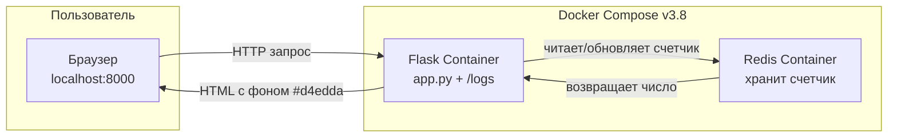
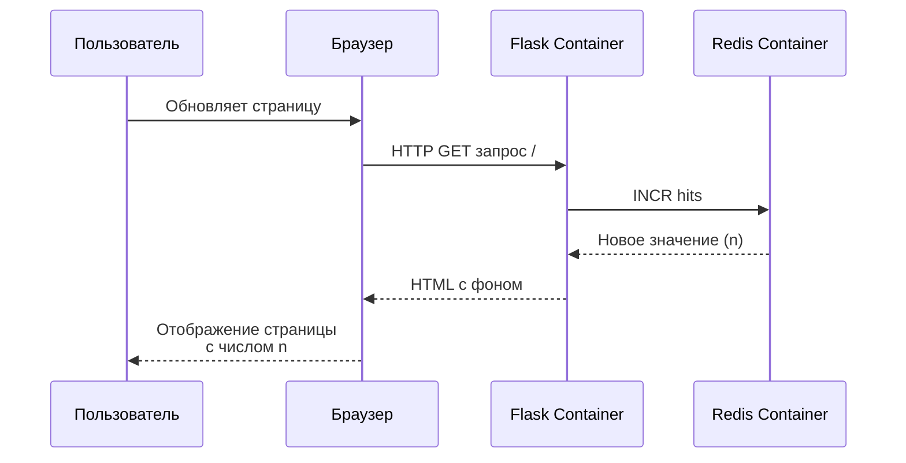

# Лабораторная работа №5. Проектирование и реализация комплексной микросервисной системы для автоматизации бизнес-процесса

**Выполнила:** Софронова Кира

**Группа:** ЦИБ-241

**Вариант:** 17

---

## Цель работы

Научиться:
- запускать многоконтейнерные приложения с помощью Docker Compose;
- организовывать взаимодействие между сервисами (Flask + Redis);
- использовать Docker Compose для оркестрации контейнеров;
- изменять бизнес-логику и инфраструктуру проекта;
- работать с Redis как с внешним сервисом хранения данных;
- модифицировать среду сборки через Dockerfile.

---

## Индивидуальное задание (вариант 17)

| № | Компонент | Требование задания |
|---|-----------|---------------------|
| 1 | Бизнес-логика (`app.py`) | Изменить цвет фона страницы через `body style` |
| 2 | Инфраструктура (`docker-compose.yml`) | Изменить версию compose файла на `"3.8"` |
| 3 | Среда сборки (`Dockerfile`) | Добавить создание пустой папки `RUN mkdir /logs` |

---

## Архитектура проекта



**Пояснение работы счетчика:**

| Компонент | Роль в работе счетчика |
|-----------|------------------------|
| **Redis** | Хранит текущее значение счетчика в оперативной памяти. Данные сохраняются даже при перезапуске Flask-контейнера. |
| **Flask** | При каждом обращении к странице вызывает команду `INCR hits` в Redis, увеличивая счетчик на 1. |
| **Браузер** | Отображает HTML-страницу с подставленным значением счетчика. |

---

## Схема взаимодействия сервисов




## Описание взаимодействия сервисов

1. **Пользователь** открывает в браузере `http://localhost:8000`.
2. **Веб-сервис (Flask)** получает запрос и обращается к **Redis**.
3. **Redis** увеличивает значение счетчика `hits` и возвращает его.
4. **Flask** генерирует HTML-страницу с измененным фоном и отображает счетчик.
5. При повторном обновлении страницы цикл повторяется, счетчик растет.

---

## Файлы проекта

### 1. `requirements.txt`

Список зависимостей Python:

```txt
Flask==2.0.1
Werkzeug==2.3.7
redis==4.6.0
```

### 2. app.py (с измененной бизнес-логикой)

```py
import time
import redis
from flask import Flask

app = Flask(__name__)

cache = redis.Redis(host='redis', port=6379)

def get_hit_count():
    retries = 5
    while True:
        try:
            return cache.incr('hits')
        except redis.exceptions.ConnectionError as exc:
            if retries == 0:
                raise exc
            retries -= 1
            time.sleep(0.5)

@app.route('/')
def hello():
    count = get_hit_count()
    # ИЗМЕНЕНИЕ ПО ВАРИАНТУ 17: изменен цвет фона через body style
    return '''
    <!DOCTYPE html>
    <html>
    <head>
        <style>
            body {{
                background-color: #d4edda;  /* светло-зеленый фон */
                font-family: Arial, sans-serif;
                text-align: center;
                margin-top: 50px;
            }}
            h1 {{
                color: #155724;
            }}
            p {{
                font-size: 18px;
            }}
            strong {{
                font-size: 24px;
                color: #0066cc;
            }}
        </style>
    </head>
    <body>
        <h1 style="color:green">
            Бизнес-стенд "Инновации"
        </h1>
        <p>
            Посетителей сегодня:
            <strong>{}</strong>
        </p>
    </body>
    </html>
    '''.format(count)

if __name__ == "__main__":
    app.run(host="0.0.0.0", debug=True)
```

### 3. Dockerfile (с измененной инфрастуктурой)

```
FROM python:3.9-alpine

WORKDIR /code

COPY requirements.txt requirements.txt

RUN pip install -r requirements.txt

COPY . .

RUN mkdir /logs

CMD ["python", "app.py"]
```

### 4. docker-compose.yml (с измененной средой)

```yaml
version: "3.8"

services:
  web:
    build: .
    network_mode: "host"
    depends_on:
      - redis

  redis:
    image: redis:alpine
    network_mode: "host"
```

---

## Описание внесенных изменений

### 1. Изменение бизнес-логики (`app.py`)

**Что было в базовой версии:**
- стандартный белый фон страницы;
- минимальное оформление без CSS;
- отсутствие стилей для тела документа.

**Что было изменено:**
- добавлен блок `<style>` в HTML-ответ;
- установлен цвет фона `#d4edda` (светло-зеленый);
- добавлены CSS-правила для центрирования контента:
  - `text-align: center` — выравнивание по центру;
  - `margin-top: 50px` — отступ сверху;
  - `font-family: Arial, sans-serif` — шрифт;
- увеличен размер шрифта для счетчика (`font-size: 24px`);
- изменен цвет текста заголовка на темно-зеленый `#155724`.

**Листинг измененного фрагмента `app.py`:**
```py
@app.route('/')
def hello():
    count = get_hit_count()
    # ИЗМЕНЕНИЕ ПО ВАРИАНТУ 17: изменен цвет фона через body style
    return '''
    <!DOCTYPE html>
    <html>
    <head>
        <style>
            body {{
                background-color: #d4edda;  /* светло-зеленый фон */
                font-family: Arial, sans-serif;
                text-align: center;
                margin-top: 50px;
            }}
            h1 {{
                color: #155724;
            }}
            p {{
                font-size: 18px;
            }}
            strong {{
                font-size: 24px;
                color: #0066cc;
            }}
        </style>
    </head>
    <body>
        <h1 style="color:green">
            Бизнес-стенд "Инновации"
        </h1>
        <p>
            Посетителей сегодня:
            <strong>{}</strong>
        </p>
    </body>
    </html>
    '''.format(count)
```

### 2. Изменение инфраструктуры (`docker-compose.yml`)

**Что было в базовой версии:**

```yaml
version: "3.9"

services:
  web:
    build: .
    ports:
      - "8000:5000"
    depends_on:
      - redis

  redis:
    image: redis:alpine
```

**Что было изменено:**

```yaml
version: "3.8"

services:
  web:
    build: .
    ports:
      - "8000:5000"
    depends_on:
      - redis

  redis:
    image: redis:alpine
```

**Таблица изменений:**

| Параметр | Базовая версия | Версия по варианту 17 |
|----------|----------------|----------------------|
| Версия Compose | "3.9" | "3.8" |
| Сервис web | `build: .` | без изменений |
| Порты | "8000:5000" | без изменений |
| Сервис redis | `redis:alpine` | без изменений |

**Обоснование изменения:**

- версия `3.8` полностью совместима со всеми используемыми директивами (`build`, `ports`, `depends_on`, `image`);
- обеспечивает стабильную работу на более старых версиях Docker Compose;
- не требует изменений в остальной конфигурации;
- является стабильной версией, поддерживающей все необходимые функции.

### 3. Изменение среды сборки (Dockerfile)

**Что было в базовой версии:**

```
FROM python:3.9-alpine

WORKDIR /code

COPY requirements.txt requirements.txt

RUN pip install -r requirements.txt

COPY . .

CMD ["python", "app.py"]
```

**Что было изменено:**

```
FROM python:3.9-alpine

WORKDIR /code

COPY requirements.txt requirements.txt

RUN pip install -r requirements.txt

COPY . .

# ИЗМЕНЕНИЕ: создание пустой папки /logs
RUN mkdir /logs

CMD ["python", "app.py"]
```

**Таблица изменений:**

| Инструкция | Базовая версия | Версия по варианту 17 |
|------------|----------------|----------------------|
| `FROM` | `python:3.9-alpine` | без изменений |
| `WORKDIR` | `/code` | без изменений |
| `COPY requirements.txt` | есть | без изменений |
| `RUN pip install` | есть | без изменений |
| `COPY . .` | есть | без изменений |
| `RUN mkdir /logs` | нет | **добавлено** |
| `CMD` | `["python", "app.py"]` | без изменений |

**Назначение папки `/logs`:**

| Характеристика | Описание |
|----------------|----------|
| **Расположение** | Корневая директория контейнера (`/logs`) |
| **Права доступа** | `drwxr-xr-x` (755) — владелец root |
| **Назначение** | Хранение логов приложения |
| **Возможное использование** | Отладка, мониторинг, аудит |
| **Перспектива** | Может быть подключена как Docker volume для сохранения логов между перезапусками |

---

## Скриншоты работы

**Результат команды `docker compose ps`**

 

**Описание:**

- контейнер `lab5_business-web-1` в статусе `running`;
- контейнер `lab5_business-redis-1` в статусе `running`;
- проброшенный порт `0.0.0.0:8000->5000/tcp`;
- оба контейнера работают без ошибок.

**Работа приложения в браузере**


**Описание:**

- измененный цвет фона страницы (светло-зеленый `#d4edda`);
- заголовок "Бизнес-стенд 'Инновации'";
- работающий счетчик посещений (значение увеличивается при каждом обновлении);
- центрированное расположение контента;
- увеличенный шрифт для отображения числа посещений.

**Результат выполнения 1 задания:**


**Результат выполнения 2 задания:**


**Результат выполнения 3 задания:**

 

---

## Выводы

В ходе выполнения лабораторной работы были решены следующие задачи.

1. Разработано многоконтейнерное приложение на основе Flask и Redis, демонстрирующее счетчик посещений веб-страницы.
2. Настроена оркестрация контейнеров с помощью Docker Compose, обеспечивающая:
  * автоматический запуск двух сервисов (web и redis);
  * сетевое взаимодействие между контейнерами по имени сервиса;
  * проброс портов для доступа извне
  * автоматическую пересборку при изменении файлов.
3. Реализовано индивидуальное задание:
* изменен цвет фона страницы через body style на #d4edda;
* изменена версия Docker Compose с "3.9" на "3.8";
* добавлено создание пустой папки /logs в Dockerfile.
